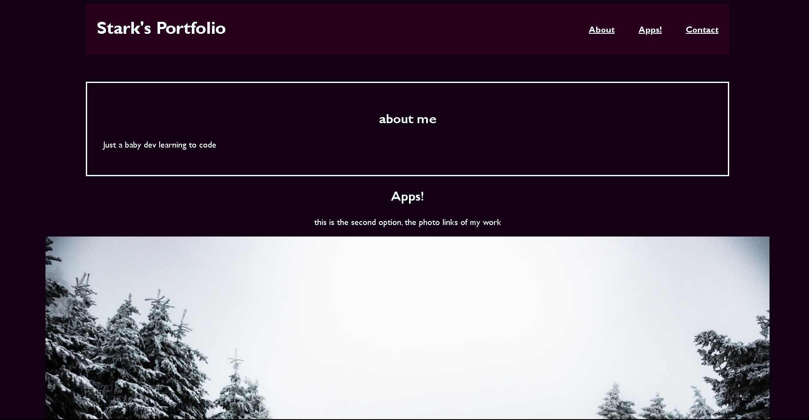
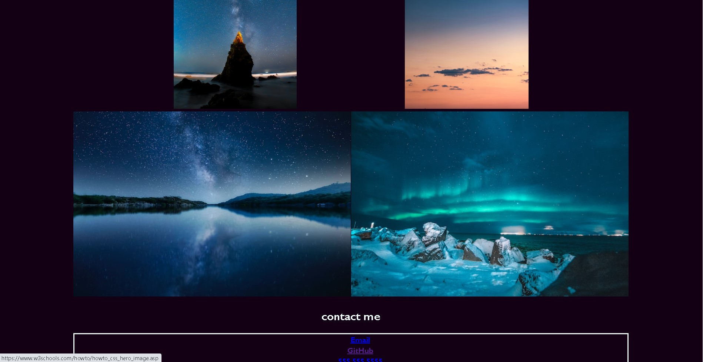

# stark portfolio 

## description

    this project combined my previous html lessons with the ccs styling aspect to create a relative and userfriendly page comprised of nav links to the sections and links to either dummy links (leading to sites I did not create in place of my apps for the time being) or to dummy contact info (the only exception to this being the github link which does lead to my person site)

## links

    you can view the GitHub repository for this page by [clicking here](https://github.com/Matt0Stark/portfolio)

    and you can view the launched page by [clicking here](https://matt0stark.github.io/portfolio/)

**screenshot**
    
    
    
